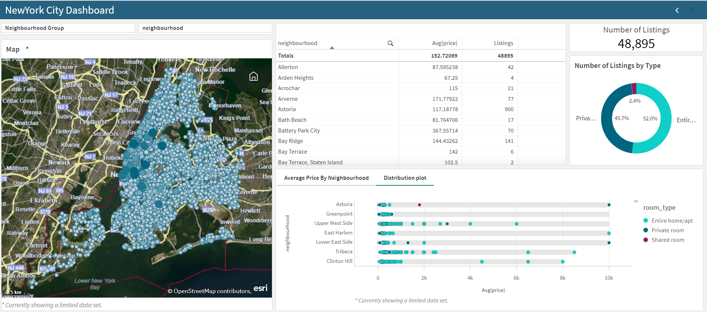
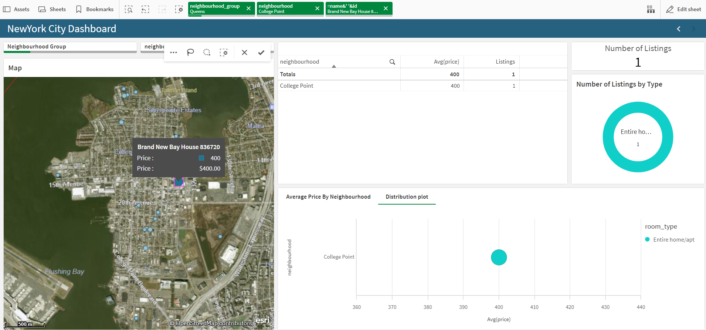

# 🏙️ New York City Airbnb Analytics – Qlik Sense Dashboard

This repository contains a **Qlik Sense Analytics application** built using the **New York City Airbnb Open Data** dataset sourced from **Kaggle**. The dashboard provides interactive visual insights into Airbnb listings across New York City neighborhoods.

## 📊 Project Overview

The objective of this project is to analyze and visualize Airbnb listings in New York City using Qlik Sense. The dashboard helps uncover patterns related to pricing, location, and listing types across different neighborhoods.

## 🗂️ Dataset

- **Source:** Kaggle – New York City Airbnb Open Data  
- **Dataset Link:** https://www.kaggle.com/datasets/dgomonov/new-york-city-airbnb-open-data  
- **Description:**  
  The dataset includes detailed information about Airbnb listings in NYC, such as:
  - Neighbourhood and neighbourhood group
  - Geographic coordinates (latitude & longitude)
  - Room type
  - Price per night
  - Availability and number of reviews

## 📈 Dashboard Features

- **Interactive Map**
  - Visualizes Airbnb listings across New York City using latitude and longitude.

- **Key Performance Indicators (KPIs)**
  - Total number of listings
  - Average listing price

- **Charts & Visualizations**
  - Average price by neighbourhood (bar chart)
  - Distribution of listings by room type (donut chart)

- **Tables**
  - Neighbourhood-level summary showing average price and number of listings

- **Filters**
  - Neighbourhood Group
  - Neighbourhood

## 🛠️ Tools & Technologies

- Qlik Sense Desktop
- OpenStreetMap (for map visualization)
- Kaggle Dataset

## 🚀 How to Use

1. Clone or download this repository.
2. Open the `.qvf` file using **Qlik Sense Desktop**.
3. Reload the data if required.
4. Use filters and interactive charts to explore insights.

## 📸 Dashboard Preview

### Main Sheet:

### Visuals to represent the selection:

